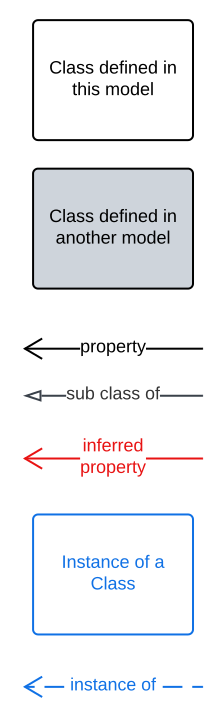

== Preamble

=== Abstract

A Semantic Web data model of geographical names, sometimes called place names, information. It caters specifically for Australian & New Zealand's naming needs.

[NOTE]
This model was made for Queensland Spatial Information, a unit of the Queensland Department of Resources, to assist with their future geographical naming needs and is a development of the Place Names ontology <<PNO>> made for ICSM and should be used in its place.

=== Namespaces

This model is built on a small set of well-regarded Semantic Web models which use a variety of namespaces. Prefixes for these namespaces, used throughout this document, are listed below.

[width=100%, frame=none, grid=none, cols="1,4,5"]
|===
|Prefix | Namespace | Description

| `*:*` | `*https://linked.data.gov.au/def/gn/*` | *This model*
| `cn` | `https://linked.data.gov.au/def/cn/` | Compound Name Model
| `dcterms` | `http://purl.org/dc/terms/` | Dublin Core Terms
| `ex` | `http://example.com/` | Generic examples
| `geo` | `http://www.opengis.net/ont/geosparql#` | OGC GeoSPARQL model
| `lm` | `https://linked.data.gov.au/def/lifecycle/` | Lifecycle Model
| `owl` | `http://www.w3.org/2002/07/owl#` | Web Ontology Language ontology
| `rdfs` | `http://www.w3.org/2000/01/rdf-schema#` | RDF Schema ontology
| `sosa` | `http://www.w3.org/ns/sosa/` | Sensor, Observation, Sample, and Actuator ontology
| `skos` | `http://www.w3.org/2004/02/skos/core#` | Simple Knowledge Organization System (SKOS) ontology
| `time` | `http://www.w3.org/2006/time#` | Time Ontology in OWL
| `void` | `http://rdfs.org/ns/void#` | Vocabulary of Interlinked Data (VoID) ontology
| `xsd` | `http://www.w3.org/2001/XMLSchema#` | XML Schema Definitions ontology
|===

=== Conformance

This model conforms to the https://w3id.org/profile/ontpub[OntPub Profile] which is a specification for ontology publication that mandates certain structural and metadata properties for the model as a whole and model elements. Metadata elements for the model as a whole - the ontology - are given in the <<Metadata>> section above.

==== Figures

Figures used in this document use the following key:

[[fig-figure-key]]
.Key of elements used in this Model's figures

==== Example Data
Example Data used in this document, for instance in model element "Example" values, are https://www.w3.org/RDF/[RDF] data in the https://www.w3.org/TR/turtle/[Turtle] syntax.