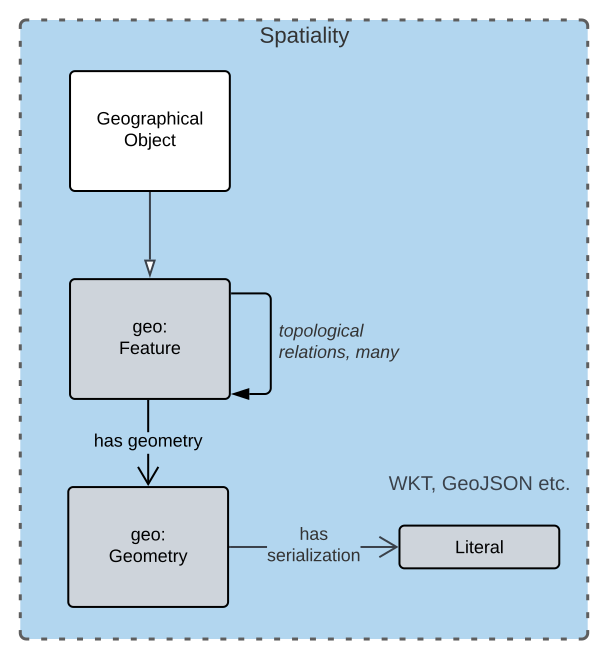

== Introduction

This model facilitates applying Geographical Name objects, sometimes called Place Names, with potentially many subcomponents, to geospatial representation of geographical objects. This style of feature name / geospatial feature modelling is informed inherited from the https://linked.data.gov.au/def/cn[Compound Naming Model] that this model extends.

NOTE: This model does not attempt to assist with detail geospatial aspects of geographical object modelling: it only provides an association between naming components and geospatial representations of the objects established using other models and with categorisation of objects. This model also does not link road objects to other, related, objects, such as geographical objects they may be within or abutting. Such linking should be represented with Feature / Feature topological relations, such as those within GeoSPARQL <<GEO>>.

Data made according to this model, when stored in one of the <<RDF>> serialization formats such as <<TTL>>, is directly validatable according to this model through use of validators that are supplied, see Section <<Validation>>.

=== Sources of Requirements

This model was initially built to allow Queensland Government to manage geographical naming information in a manner similar to how they manage Address & Roads Name information: as a collection of Feature Names for Features with spatial information such as type categorisation, geometries and spatial relations. This introduces requirements to both facilitate complex naming and align with Address etc. modelling.

To ensure that this model implements that Feature Names / Features / Geometries pattern, it is a profile of the Compound Naming Model <<CNM>> and GeoSPARQL <<GEO>> which captures the required patterns in generic form and are also profiled by Queensland Government's Address & Geographic Names Models. By adopting GeoSPARQL as its spatial modelling base, this model allows for detailed spatial object modelling, including spatial object categorisation and complex, multiple and even fuzzy geometry modelling.

This model also aims to handle a series long-standing known concerns specifically related to naming, in particular:

* name changes over time
* official/unofficial names
* indigenous naming
* named object categorisation

Detailed requirements for this model all stem from these top-level requirements. The individual requirements are listed in the <<Requirements>> section.

=== Major Modelling Principles

Major modelling principles present in this model are:

. Feature / Feature Naming differentiation
. Detailed spatial modelling
. Multiple names
.. Official/unofficial names
.. Name changes over time
.. Indigenous / multi-lingual naming
. Geographical Object categorisation

==== Feature / Feature Naming differentiation

This model defines a Geographical Object and a Geographical Name class. The former is for a named spatial object, the latter for detailed naming information. The general conceptual split of spatial object/name follows the Address/AddressableObject split in ISO19160-1 <<ISO19160-1>>. Addresses there are seen as a form of complex, multi-part, label - Feature Name - for a spatial Feature and Geographical Names here are considered a form of that.

This allows for the representation, and ultimately the management, of labels - text, numbers, identifiers, references - separately to the management of spatial objects.

This Feature / Feature Naming separation applies to Roads and Administrative Areas as well as Addresses and this model's expression of Feature / Feature Naming separation is attained by making it a formal profile of the _Compound Naming Model_ <<CNM>> which expresses it in general terms. Other profiles of the CNM for Addresses etc. are detailed in Queensland Spatial Information's https://linked.data.gov.au/def/qsi-supermodel[_Supermodel_] which is an enterprise data model for multi-model data integration.

==== Detailed spatial modelling

Historically, Place Name Gazetteers have been limited in their spatial representation of named places, usually to point locations. This is clearly not sensible for objects with significant spatial coverage, such as mountain ranges or even population centres. For this reason, this model allows for the detailed spatial modelling of Geographical Objects using powerful spatial models, in particular GeoSPARQL <<GEO>>. GeoSPARQL allows for many kinds of geometries, and even multiple geometries, to be used to characterise the spatial presence of a Feature, which a Geographical Object is a special kind of. Figure <<fig-gn-spatial>> shows the general pattern of relations defined by GeoSPARQL.

[[fig-gn-spatial]]
.Geographical Object spatial modelling

This model does not further elaborate on the detailed spatial representation or relations of Geographical Objects - for that see GeoSPARQL itself - however a specific extended use of GeoSPARQL is called out here: fuzzy geometry modelling.

Geographical Names are often not precisely defined by administrative or natural boundaries so modelling of their spatial extent should cater for this. The _Extended Geometries Ontology_ <<EGO>> is a GeoSPARQL extension that provides mechanisms for describing fuzzy boundaries and this ontology, as well as GeoSAPRQL itself, should be used for this. The <<Examples>> section shows this.

==== Multiple names

Geographical Objects may have multiple names in one of several or even multiple, different, forms. For example, a name may have been used for a place historically but that name is no longer recommended for use. Or a place may have different names in multiple languages or concurrent official and unofficial names.

===== Official/unofficial names

This model conveys the officialness of a Geographical Names by indicating who is or was responsible for a name status, with statuses defined in a vocabulary, and when the status is in effect. The official status of a name may then be determined by:

* whether one accepts the jurisdiction of the name creator/alterer
* what the time period of interest is

For example, in the State of Queensland in 2023, the Minister for Resources has the jurisdictional authority within the State for the gazetting of place names, thus the claim that "K'gari" - the name for a Geographical Object formerly known as "Fraser Island" - is the official place name (the gazetted name) of the Object since its naming by the minister in June, 2023, must be respected within the State after the naming. It is possible that other jurisdictions do not honour that name status and use - officially or otherwise - different names for K'gari.

===== Name changes over time

Objects' names change over time and this model allows for them to have statues that have temporality indicated. the island "K'gari" has only officially, within the State of Queensland, been known as such since the 7th of June, 2023. From the 10th of May, 1842 until that date, it was officially known as "Fraser Island".

See the example in <<Examples>>.

Note that this model allows for names with different statuses so that the island now called "K'gari", is still called "Fraser Island" in some unofficial way - perhaps this is now a historical place name.

This model does now enforce a particular handling of names and statuses: it only supplies mechanisms for representing names and statuses over time.

===== Multiple names

It is easy to see how places might have multiple names over time or perhaps multiple names concurrently with different statuses. However, it is also possible that places may have multiple Names with the same status concurrently. In such cases, the different Names may need to be distinguishable via other properties, perhaps the language of the name, but perhaps not: perhaps some places may simply have more than one name at a time with the same status.

Particular rules about name concurrency will need to be created and used by model implementers.

===== Indigenous / multi-lingual naming

The language of a name may be indicated with a recognised language code applied to the name. For example, "Tasmania" may be indicated as being an English name with use of the ISO 639-1 2-letter language code <<ISO639-1>> "en" or perhaps the ISO 639-2 3-letter language code <<ISO639-2>> "eng" or similar.

Extended ISO639-like language codes may be used for indigenous languages or language variants as long as the code's definition is discoverable.

Names in multiple languages may exist concurrently, with different or the same statuses, depending on implementer's own rules. See <<Examples>>.

==== Geographical Object categorisation

Geographical Objects named are often categorised and Australian Place Name Gazetteer datasets have historically contained categorisation for/alongside or with the names gazetted. Here, as per the <<Feature / Feature Naming differentiation>> modelling principle above and as per the Place Names ontology <<PNO>>, object categorisation is applied to the object names, not the name itself. Thus, the object now named "K'gari" and previously named "Fraser Island" has not lost its categorisation of _Island_ wich is applied to the Geographical Object, not either of the Geographical Names.

=== Model resources

This document is this model's "Specification" which is its authoritative, human-readable, definition document. This model also contains other resources with other roles:

[width="75%", cols="2,1,4"]
|===
| Resource | Role | Notes

| https://linked.data.gov.au/def/gn.ttl[Ontology] | _Schema_ | The technical, machine-readable, version of this model
| <<Supporting Vocabularies>> | _Vocabulary_ | The codelist vocabularies developed for this model and links to others defined elsewhere but used by this model
| <<Requirements>> Section | _Guidance_ | The Requirements addressed by this model
| <<Validation>> Section & https://linked.data.gov.au/def/gn/validator.ttl[SHACL Validator] | _Validation_ | The machine-readable validator file used to validate data claiming conformance to this model
| <<Templating>> Section | _Guidance_ | The template logic used for Basic and Short Form templates
| <<Examples>> Section
&
https://github.com/Spatial-Information-QLD/geographical-names-model/tree/main/extended-examples[Extended example data files] | _Example_ | Examples of data conforming, and some not conforming, to this model
| https://github.com/Spatial-Information-QLD/geographical-names-model[Code Repository] | _Code Repository_ | The online, version control, repository containing all the resources of this model
|===
