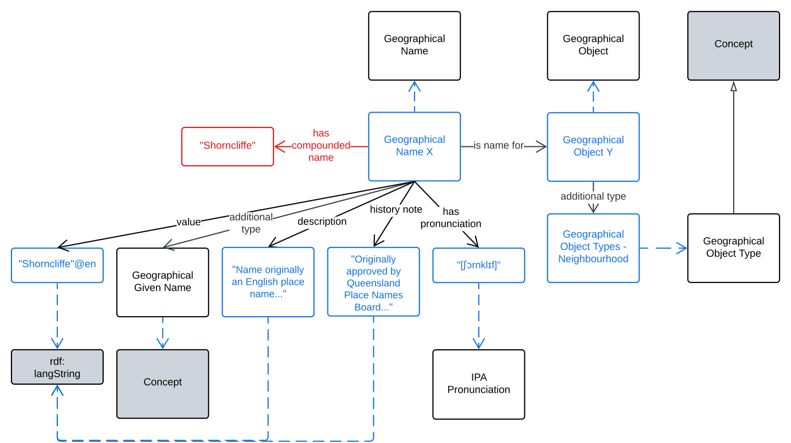

== Examples

=== Basic Use

[[fig-eg-1]]
.An example of basic use of this model to describe the Geographical Name "Shorncliffe"

=== Name Type Parts

[[fig-eg-2]]
.An example of basic use of this model to describe the Geographical Name "Lizard Island" which, while containing the feature-related part "Island" also has the Geographical Object categorised as an Island. The name part and categorisation need not match, for example "Nanny Goat Creek" may be the name for a Geographical Object categorised as a _Watercourse_, not a _Creek_ (no such categorisation exists in the usual vocabulary used for categorisation)

=== Multiple Names

[[fig-eg-3]]
.An example for the Geographical Name "K'gari" for an island formerly known as "Fraser Island". Note that while "Fraser Island" is preserved as a _Historical_ name, specific decisions about name statuses are not part of this model but must be handled by implementers according to their needs. This model just allows for any status sequencing and representation.

=== Authority

[[fig-eg-4]]
.An example showing use of this model indicating the Agent responsible for the name of a Geographical Place Name. Note that the role of _Custodian_ is the preferred term for  for a jurisdictional authority name issuer's role.

